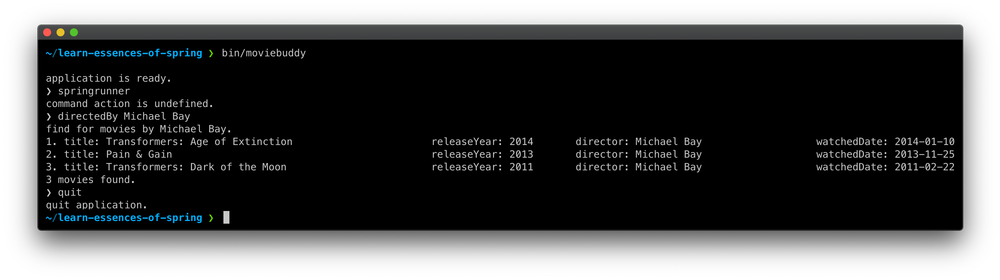

# Learn Essence of Spring Template

본 프로젝트는 Learn Essence of Spring 워크숍(강좌)에서 사용할 템플릿 프로젝트입니다. 

---

## MovieBuddy



여기 순수 자바로 작성된 콘솔 애플리케이션이 있습니다. 보시는 것처럼 그래픽 유저 인터페이스가 없습니다. 검은 바탕에 흰 글자로 구성된 콘솔 창에서 명령 프롬프트를 통해 명령어를 입력하면, 그에 해당하는 동작을 수행하고 결과를 텍스트로 출력합니다.

이 애플리케이션은 잘 동작하고 있지만, 코드에서 나쁜 악취가 많이 나고 있습니다. 이 와중에 몇 가지 기능을 더 추가해야 합니다. 워크숍(강좌) 과정에서 이 콘솔 애플리케이션에 스프링 프레임워크를 도입하고, 리팩토링을 통해 점진적으로 코드를 개선해볼 것입니다.

### 빌드 및 실행 방법
저장소를 복제하거나 압축 파일로 내려받은 받은 후 다음 명령어를 통해 애플리케이션을 빌드하고, 실행할 수 있습니다.
```
$❯ ./gradlew clean build
$❯ unzip build/distributions/moviebuddy.zip -d build/
$❯ build/moviebuddy/bin/moviebuddy
```

### 사용법
```
// 감독으로 영화 검색하기
❯ directedBy Michael Bay

// 개봉연도로 영화 검색하기
❯ releasedYearBy 2015

// 애플리케이션 종료하기
❯ quit
```

### 개발환경
- Java SE 11
- Gradle 6.6

---

워크숍(강좌)에 대한 자세한 소개는 [여기](https://springrunner.dev/training/learn-essence-of-spring-workshop/)에서 볼 수 있습니다.


---

#### 여기서 부터는 강의 내용을 정리한 부분입니다.

---


>일반적으로 자바프로그램은 프로그램의 시작점인 메인메서드가 시작되는 시점에
 프로그램이 사용할 객체를 생성하고 생성된 객체에 있는 메서드를 호출하고
 호출된 메서드에서 필요한 객체를 생성하는 것을 반복하는 방식으로 진행된다.
 각 객체는 프로그램 흐름을 결정하거나 사용할 객체를 구성하는 작업에 능동적으로 참여한다.

---
### 제어의 역전

- 프로그램의 제어 흐름의 구조가 뒤바뀌는 것을 말한다 프레임워크나 서블릿 컨테이너 등에 적용된 개념이다.
- 제어의 역전 개념을 적용하면 설계가 깨끗하지고 유연성이 증가하며 확장성이 좋아진다.
- 특정 기술이나 환경에 종속되지 않은 보편적으로 사용되는 프로그래밍 모델이다.
- 스프링은 제어의 역전을 모든 기능의 기초가 되는 기반기술로 삼고 , 극한으로 활용한다.

---

### SOLID 원칙

- SOLID는 깔끔한 설계를 위해 적용 가능한 다섯가지 소프트웨어 설계 원칙이다.
- 함수와 데이터 구조를 클래스로 배치하는 방법 , 그리고 이들 클래스를 서로 결합하는 방법을 설명해주며 
- 모듈고 컴포넌트 내부의 구조를 이해하기 쉽고 변경에 유연하게 만드는데 목적을 두고 있다.

1. OCP(Open Closed principal) 
- 클래스나 모듈은 확장에는 열려있어야 하고 변경에는 닫혀있어야 한다.
 * 해당 프로젝트에 MovieFinder 클래스는 MovieReader 인터페이스를 통해 메타데이터를 불러오는 기능을 제공받고 있으며
   MovieReader는 인터페이스로 구현되어 얼마든지 확장이 가능하도록 개방되어있다. 
   반면 MovieFinder는 MovieReader의 변경에 영향받지 않고 폐쇄되어 있다.
   
2. DIP(dependency inversion principal)
- 상위 정책은 하위 정책에 의존하면 안되며 , 하위 정책이 상위 정책에 정의 추상타입에 의존해야한다.
 * MovieFinder는 추상화된 MovieReader에만 의존하고 있으며  런타임시에 생성자를 통해 CsvMovieReader 객체를 전달받아 
   동작하고 있다 . 때문에 다형성을 적극적으로 활용할 수 있으며 객체의 재사용성이 높아진다.
   
---
### 관심사 분리(Separation of Concerns)와 높은 응집도 , 낮은 결합도

- 관심이 같은 것끼리 한곳에 모으고 , 다른 것을 따로 떨어뜨려 서로 영향 주지 않도록 분리하는 것을 말한다.
- 응집도가 높다는 건 하난의 모듈, 클래스가 하나의 책임 또는 관심사에만 집중되어 있다는 뜻이다.
- 높은 응집도는 패키지 , 컴포넌트 , 모듈에 이르기까 대상의 크기가 달라도 동일한 원리고 적용될 수 있으며 계층화도 이 원리에 따라 적용된다.
- 결합도가 낮다는 건 하느의 오브젝트가 변경될 때에 관계를 맺고 있는 다른 오브젝트에 영향을 주지 않는다는 뜻이다.
- 결합도가 낮아지 변화에 대응하는 속도가 높아지고 구성이 깔끔하며 확장하기 편리하다.

### Strategy Pattern
- 개방 폐쇄 원칙 실현에 가장 적합한 패턴이다
- 자신의 기능 맥락에서 필요에 따라 변경이 필요한 알고리즘을 추상화를 통해 외부로 분리하고 
  이를 구현하는 클래스들을 통해 필요에 다라 바꿔 사용할 수 있게하는 패턴을 말한다,
  * MovieReader 인터페이스를 통해 loadMovie()라는 로직이 추상화 되며 이를 구현한 csv , jaxb reader 
    클래스가 Context의 필요에 따라 바꿔 사용되고 있다.이떄 MovieFinder는 전략패턴의 Context에 해당한 
    
---

### 의존관계와 의존관계 주입(Dependency)

- MovieFinder는 코드 시점에선 MovieReader 인터페이스를 의존하지만
- 실행시점에선 CsvMovieReader 혹인 JaxbMovieReader를 의존한다. 
- 이와 같이 코드 시점 의존 관계와 실행 시점의 의존관계가 다를 수 있다는 점은 다형성이 사용되는 중요한 이유이다 .
- 협력을 위해 필요한 의존관계는 유지하면 변경을 방해하는 의존 관계는 제거하는 것이 중요하며
- 이런 관점에서 객체지향 설계란 의존관계를 관리하는것이고 객체가 변경을 받아들일 수 있게 의존 관계를 정리하는 기술이라 할 수 있다.
- 외부의 다른 객체가 의존성이 필요한 클래스에가 필요한 의존성을 전달하는 방식을 의존 관계 주입이라한다.
- 외부에서 의존 관계 대상을 해결한 후 이를 사용하는 객체 쪽으로 주입한다.

---

#### 의존 관계 주입의 3가지 방식

- 생성자 주입(Constructor injection)  객체를 생성하는 시점에 생성자를 통해 의존 관계를 해결
- 설정자 주입(setter injection) setter 메서드를 통해 의존성을 주입
- 메소드 주입(method injection) 메서드 실행 시 인자를 이용한 의존관계를 주입.

---

### 스프링 IOC 컨테이너 와 빈(bean)

- 스프링은 제어의 역전 원칙에 따라 객채의 생성, 의존관계 주입과 같은 기능을 제공하는 Ioc 컨테이너로 bean factory를  제공하며 일반적으로는 bean factory를 확장한 ApplicationContext 객체를 사용한다.

- ApplicationContext은 빈팩토리의 특징을 그대로 가지고 있으면서 스프링 AOP 통합 , 국제화지원, 이벤트 기반 애플리케이션 , web 과 같은 기능을 제공한다.

- 스프링이 제거권을 가지고 직접 생성 , 의존관계를 주입하는 객체를 bean 이라하며 , 자바 빈즈 또는 엔터프라이즈 자바 빈즈에서 말하는 bean과 비슷한 객체 단위의 애플리케이션 컴포넌트를 말한다.

- ApplicationContext는 configuration metadata 라는 빈 구성 정보를 읽어 빈을 생성하고 관리하며 .  이를 바탕으로 애플리케이션을 구성한다.


---

### 스프링 IOC 컨테이너의 특징

- 컨테이너는 제어의 역전(inversion of control) 원리가 적용된 스프링 핵심 컴포넌트이다
- 컨테이너에 의해 생성 및 조립된 후 관리되는 객체를 빈이라 부른다.
- 빈 생성시 의존관계 주입(dependency injection)이 일어난다
- 빈 구성정보를 바탕으로 비지니스 오브젝트를 이용해 애플리 케이션을 구성하고 생애를 관리한다.
   
---

### bean 구성 정보 ( configuration metadata )란 ? 

- 스프링 컨테이너가 빈 객체 생성 및 구성 , 조립시 사용하는 설정정보이다. 
- 스프링은 빈구성정보를 읽고 내부적으로 bean definition 이라는 인터페이스로 추상화된 객체를 만들어 사용한다.
- 컨테이너 기능을 설정하거나 조정이 필요할 때도 사용된다. 
- 자바 코틀린 그루비 XML 등 다양한 방식으로 작성할 수 있다.

> @Configuration : 클래스가 컨테이너의 빈 구성정보로 사용될 목적임을 선언하는 애노테이션 <br/>
  @Bean: 컨테이너에서 등록할 사용할 빈 객체를 생성하고 구성 및 초기화를 선언하는 애노테이션 <br/>

---

### bean scope

- 스프링 컨테이너는 빈을 생성할 떄 단 하나의 빈을 만들지 아니면 빈이 요청될 때마다 새로운 빈을 생성할지를 결정하는  메커니즘을 가지고 있으며 이를 빈 스코프라 부른다.
- 하나의 빈 객체를 만들땐 singleton scope
- 빈이 요청될때마다 새로운 빈을 생성하는 것을 프로토 타입 스코프라고 한다.
- default는 싱글톤 스코프이다.
- spring web에서는 리퀘스트 , 세션 ,웹소캣, 애플리케이션 등 몇가지 빈스코프가 더 제공된다.
- singleton scope는 가장 기본적인 scope이며 스프링 컨테이너가 시작될때 생성되고 종료될때 소멸한다.

> @Scope : 빈에 대한 스코프 방식을 지정해 줄 수 있다 . 

---

### bean 구성 정보 조합

- 관심사가 같은 구성 정보끼리 모아 모듈화가 가능하다.

> @Import : 애노테이션을 선언한 클래스에서 필요한 구성정보 클래스를 import 해온다 </br>
 @ImportResource: xml로 정의해놓은 구성정보를 가져온다.  


---

### Component scan

- 컴포넌트를 찾아 자동으로 빈으로 등록하고 관리한다.

> @ComponentScan : 지정된 패키지 경로에서 @Component 같은 스테레오 타입의 어노테이션(@Controller , @Service , @Repository)이 붙은 클래스를 찾아 빈으로 등록하고 관리한다.</br>
> 패키지가 지정되지 않으면 @ComponentScan이 선언된 클래스를 기준으로 찾는다.
> basePackages옵션으로 컴포넌트 스캔 시작 패키지를 지정할 수 있다. 
  @Component : 해당 클래스가 ComponentScan의 대상이 되도록한다


---

### Auto Wiring

- 컴포넌트가 빈으로 등록될때 @Autowired를 확인하고 의존관계를 자동 주입한다.
- @Autowired를 생성자에 붙혀 사용하며 생성자가 하나일때는 생략 가능하다.
-  @Autowired는 기본적으로 생성자의 파라미터 타입을 기준으로 의존관계를 주입한다. 

#### bean 이름 지정
- @Component("bean이름")으로 해당 빈의 이름을 지정할 수 있다.
- 스프링 빈은 @Bean으로 직접 등록할시 메서드의 이름이 빈의 이름이 되고
- @Component등 컴포넌트 스캔에의해 생성될 때는 해당 클래스의 이름이 카멜케이스로 변환되어 빈의 이름이 된다

#### @Autowired  bean  지정 두가지 방법
- 만약 파라미터 타입이 인터페이스고 구현체가 여러개라면 파라미터 변수의 이름으로 의존관계를 주입하며
  변수명은 컴포넌트 선언시 정의한 bean의 이름과 매칭된다.
- @Quailfier를 이용해 주입 되어야 하는 빈을 지정해 줄수도 있다.

````java
    //bean 이름
    @Repository("csvReader")
    public class CsvMovieReader implements MovieReader {};
    //의존관계 주입시 파라미터 변수명과 빈이름이 매칭된다
    @Autowired
    public MovieFinder(MovieReader csvReader) {
        this.movieReader = Objects.requireNonNull(csvReader);
    }
    
    //@Qualifier 사용
    @Autowired
    public MovieFinder(@Qualifier("csvMovieReader") MovieReader csvReader) {
            this.movieReader = Objects.requireNonNull(csvReader);
    }
````

</br>

#### 각 레벨별 autowiring 특징

1. field level 
    - 필드에 직접 @Autowired 어노테이션을 달아주면 된다.
    - 외부에서 변경이 힘들어지기 떄문에 테스트가 힘들어진다 . 

</br>


---

### Spring Test

- 스프링의 포조 프로그래밍은 테스트를 손쉽게 작성할 수 있는 환경을 제공하고 
- 기술에 종속되지 않는 코드를 작성할 수 있게 해준다.
- 애플리케이션을 서버에 배치하거나 테스트 서버에 연결하지 않아

>@SpringJUnitConfig: @ExtendWith,@ContextConfiguration 어노테이션이 합쳐진 어노테이션 </br>
</br>
@ExtendWith(SpringExtension.class):  테스트 실행 전략을 확장할 떄 사용하는 애노테이션 </br>
*SpringExtension.class : 스프링 테스트에서 제공하는 Junit 지원 클래스 </br>
</br>
@ContextConfiguration : 테스트 컨텍스트의 빈구성정보를 지정하는 애노테이션 빈구성 정보 클래스를 classes옵션으로 넘겨주면 된다.</br>


---

### 엔터프라이즈 애플리케이션의 계층

</br>

<b>presentation </b>: 사용자와 소프트 웨어간 상호작용을 처리

v
</br> 

<b>domain </b> : 핵심 업무 논리를 처리하는 객체들로 구성되며 애플리케이션에서 가장 중요한 자산이다.
</br> 
v
</br> 
<b>persistance</b> : 파일 또는 데이터베이스 시스템 등과 데이터 송/수신 처리를 맡는다.

---

### separated interface pattern

<br/>

- 추상화 인터페이스를 클라이언트에 속한 패키지에 포함하는 구조를 말한다 
- 추상화 인터페이스를 클라이언트로 포함시켜 도메인 패키지를 완벽하게 분리시킬 수 있다.
- 성격이 다른 추상화 인터페이스가 필요하다면 새로운 패키지를 추가하고 새로운 구현체를 만들면 상위 수준의 협력 관계를 재사용할 수 있다.

---

### 스프링의 객체 지향

- 애플리케이션 기능을 구현하기 위해 협력에 참여하는 객체들 사이의 상호작용
- 객체들은 협력에 참여하기 위해 역할을 부여 받고 역할에  적합한 책임을 수행한다.
- 스프링은 어떻게 객체가 설계되고 , 만들어지고 , 어떻게 관계를 맺어 사용되는지에 중점을 둔 프레임워크이다.
- 스프링을 사용만한다고 깨끗하고 유연한 코드가 저절로 만들어지지 않는다.

</br>

---


### Profile : 환경에 따른 bean 구성 
</br>
- 해당 프로젝트에서 MovieFinder는 파일로 부터 영화 목록을 불러오는 역할을 하는 movieReader를 통해 csv,xml 파일로 부터 목록을 불러올 수 있지만 , 둘중 하나만의 기능을 사용할 수 있다. 때문에 만약 두가지 모두 상황에 맞게 동작하게 하려면 csv  버전과 xml 버전으로 나눠 배포해야 할 것이다.
- 스프링 위와 같은 문제를 해결하기 위해 Profile을 통해 환경에 따른 bean 구성 기능을 제공한다
- 각 profile을 상수값으로 저장할 클래스를 만든다. 

</br>
</br>
> @Profile : 특정 환경에 빈이 동작하도록 profile을 지정한다. </br>
@ActiveProfile : 테스트 환경이 특정 profile으로 동작하도록 지정한다. </br>


</br>

#### 런타임 환경에서 프로파일을 설정

</br>

1. applicationContext에 setProfile() 메서드를 통해 지정한다 (프로파일을 지정한 후에 컨텍스트가 생성되도록 해야함) </br>


2. vm argument로 profile을 전달하여 실행 (intellij 기준)

 - edit configurations > modify options > add vm options > 아래 코드 추가
````
-Dspring.profiles.active=프로파일 이름
````


</br>

--- 

### 스프링 로깅

- 스프링은 SLF4J와 Log4j 로깅 프레임워크를 기본  라이브러리로 사용한다
- slf4j는 추상 로깅 프레임워크이기 떄문에 단독으로는 로깅이 불가능 하다.

</br>

--- 

### Portable Service Abstraction (PSA)

- 환경과 구현 기술의 변경과 무관하게 일관된 방식으로 기술을 다룰 수 있게 지원한다. 
- 엔터프라이즈 애플리케이션에 사용되는 다양한 기술의 서비스 추상화가 제공된다. 
- 제어의 역전 원리를 통해 POJO에게 제공된다.


---

### Bean 생명주기 관여

#### 1.callback Interface

- 빈의 생성과 소멸 시점에 원하는 코드를 수행시킬 수 있다.
- InitializingBean인터페이스의 afterPropertiesSet() 메서드를 통해 bean에 의존성 주입이 완료되고 생성되는 시점에 개입할 수 있다.
- Disoposable 인터페이스의 destroy() 메서드를 통해 빈이 소멸하는 시점에 개입할 수 있다.

#### 2.애노테이션을 활용

- JSR250으로 정의되어 있는 자바 표준 애노테이션을 사용해 빈의 생명주기에 관여할 수 있다.
- JSR250은 자바 플랫폼을 위한 콩통 애노테이션에 관한 스펙이다.
> https://en.wikipedia.org/wiki/Jakarta_Annotations (wikipidia JSR250 링크) 
- @PostConstruct , @PreDestroy로 빈의 생명주기에 관여할 수 있다.
- 특정규약과 환경에 종속되지 않고 객체를 작성하기 위해서는
- 초기화 또는 소멸시 필요한 작업은 표준 애노테이션을 사용하는 것이 좋다.
- JSR250 사용을 위해 아래의 의존성이 필요하다.
````
'javax.annotation:javax.annotation-api:1.3.2'
````


---

### 스프링 환경 추상화 (Environment Abstraction)

- 실행 환경에 따른 빈 구성을 할 수 있고 ,일관된 방식으로 외부 설정정보를 관리하고 ,접근한다.
- 프로파일과 프로퍼티소스로 구성되며 , 컨테이너와 통합 된 서비스 추상화이다.


#### 1. Environment 인터페이스

- 외부 설정파일이나 VM argument 시스템 환경변수 등을 일관된 방식으로
- 환경정보를 읽을 수 있는 런타임 환경 서비스 추상화 인터페이스이다.

#### 2. @Value 애노테이션 사용

- @Value("${변수명}") 형식으로 사용하며 생성자 혹은 , setter 메서드에 , 필드 , 메서드 파라미터에서 사용할 수 있으며
- 필요한 환경정보 값을 주입 받을 수 있다.


#### 3. @PropertySource("/application.properties")

- 컨테이너에서 사용할 환경 정보 파일을 지정해 줄 수 있다.

#### 4. @TestPropertySource(properties ="프로퍼티명")

- 테스트 환경에서 사용할 환경정보를 테스트에 맞게 임의로 지정할 수 있다.    

#### 5. 프로퍼티 치환자 사용

- PropertySourcesPlaceholderConfigurer 를 빈으로 선언한다
- 이떄 static 메서드로 선언해야 하는 규약이 있다.
- @Value("${property key:변수 }) 변수를 지정하면
- PropertySourcesPlaceholderConfigurer가 해당 프로퍼티 키에 맞는 값을 치환해준다.


---

### 리소스 추상화를 위한 Resource ,ResourceLoader 인터페이스

- 파일이나 원격지의 자원에 일관된 방식으로 접근하고 사용할 수 있는 인터페이스이다.
- 스프링은 컨테이너가 사용할 설정정보부터 필요한 외부 리소스의 사용을 추상화 인테페이스를 사용하여 해결한다.
- 리소스 이름 , 경로 설명 같은 정보들을 얻거나 리소스 존재여부를 확인하는 api를 제공한다.
- resourceLoader의 getResource()에 파라미터로 path를 넘기면 해당 path의 resource를 읽어들여 Resource 객체로 반환해준다.
- 이떄 path로는 네트워크(http , ftp  등..) , 파일시스템 ,URL,classpath 등 다양한 방식으로 리소스를 얻어올 수 있으며
- 어떤 방식으로 리소스를 받아도 코드에는 영향을 주지않고 알아서 작동한다. 
- resourceLoader를 주입 받기위해선 주입받는 클래스에서 ResourceLoaderAware 인터페이스 구현이 필요하다. 


---

### 캐시 (Cache)

- 캐시는 임시 저장소를 뜻하며 , 애플리케이션 성능을 향상시키는 기법 중 하나이다 .
- 객체 캐싱(Object ceching)은 기존에 사용된 객체를 캐시에 저장해두덨다가 다시 참조될 때 사용하는 방법이다.
- 메모리의 크기가 무한하지 않기 떄문에 캐시를 사용할때 사용할 저장소의 용량을 고려해야 한다 .
- 캐시의 크기는 애플리케이션의 동작에 영향을 주지 않을 만한 크기여야한다.
- 최대 개수 , 만료 시간등을 이용해 캐시를 효율적으로 사용하는 것이 필요하며 이를 캐시 관리라 한다.

#### 스프링의 캐시 추상화 cache 인터페이스와 cacheManager 인터페이스

- 애플리케이션 코드에 영향을 주지않고 다양한 캐싱솔루션을 일관된 방식으로 사용할 수 있게 해준다.
- 다양한 캐시 라이브러리와 호환된다.


---

### AOP(Aspect Oriented Programmin) : 관점 지향 프로그래밍

- 모듈화된 부가 기능과 적용 대상의 조합을 통해 여러객체에 산재하여 나타나는 횡단 관심사를 손쉽게 개발하고 관리할 수 있는 기술
- 스프링은 자바 JDK에서 지원하는 동적 프락시 기능을 통해 복잡한 빌드 과정이나 바이트 조작 기술 없이도 
- AOP를 적용할 수 있는 프락시 기반 AOP 기술을 제공한다.
- 애플리케이션의 부가기능을 모듈화하고 , 핵심기능과 상호 작용할 수 있게 한다.
- 객체지향 프로그래밍의 가치를 지킬 수 있도록 돕는 보조적인 기술이다.


#### 횡단 관심사와 객체지향 프로그래밍의 한계

- 애플리케이션 전반에 걸쳐 필요로 하는 부가적인 기능을 횡단 관심사(Crosscutting-Concerns)라고 한다
- 횡단 관심사가 핵심기능 모듈에 침투하면 내부 복잡도가 올라가고 객체지향의 장점을 잃어 버린다.
- 스프링에서는 이를 해결하기 위해 관점지향프로그래밍 (Aspect Oriented programming)을 지원한다.

#### Proxy

- 클라이언트와 핵심기능 사이에서 마치 자신이 클라이언트가 사용하는 실제 대상처럼 위장해서
- 클라이언트의 요청을 받아 주는 갳체를 Proxy라 부른다
- 프락시를 통해 최종적으로 요청을 위임받는 객체를 타겟 오브잭트 ,대상 객체라 부른다.
- 프락시의 특징은 대상객체와 같은 인터페이스를 구현한다는 것과
- 프락시가 대상객체를 제어할 수 있는 위치에 있다는 것이다.
- 프락시는 사용목적에 따라 두가지로 분류된다

#### 데코레이터 패턴

- 데코레이터 패턴: 대상객체에 부가 기능을 부여해 주기 위한 프락시 패턴
  * 프락시가 꼭 한개로 제한되지 않으며 프락시가 직접 대상 객체를 사용하도록 고정 시킬 필요는 없다
  * 위와 같은 특징을 통해 데코레이터 패턴은 같은 인터페이스를 구현한 여러개의 프락시를 단계적으로 위임 시키는 구조를 사용할 수 있다.   
- 프락시 패턴 : 클라이언트가 대상 객체에 접근하는 방법을 제어하기 위해 사용되는 패턴

#### Dynamic Proxy 

- 프락시는 유용하지만 구현하는 인터페이스에 종속적이라는 단점이 있다.
- 구현한 프락시의 기능이 역할과 책임이 완전히 다른 객체에서도 필요하다면 여러 클래스에서 코드가 중복되게 된다.
- 이를 해결하기 위해 자바에서는 리플렉션 API을 통한 동적 프락시 기술을 제공한다.
- 리플렉션은 자바의 코드 자체를 추상화해서 접글할 수 있도록 만들어 주는 API이다
- 객체의 메서드 혹은 필드의 정보를 추출하거나 이용할 수 있게 해준다.
- 리플렉션은 다루기 까다롭고 어렵다 직접적으로 사용하기 보다는 잘 만들어진 프레임워크나 라이브러리를 통해 간접적으로 사용하는 것이 좋다 

#### Advice API

- 대상 객체에 적용하는 순수한 부가기능을 담은 객체이다.
- org.aopalliance.aop.Advie 인터페이스 기반으로 용도에 따라 여러가지 확장 인터페이스를 제공한다

#### 어드바이스 종류

|종류| 설명                                                                                                                                        | 
|----|-------------------------------------------------------------------------------------------------------------------------------------------|
|MethodInterceptor| * 가장 기본적인 어드바이스로 대상 객체의 메소드가 호출되는 전 과정을 모두 참여할 수 있는 어드바이스 이다.<br/>* 파라미터로 받는 MethodInvocation 객체는 대상 객체와 메소드의 정보를 취득하거나 실행 후 결과를 받을 수 있다. |


#### PointCut API

- 포인트컷은 부가기능을 적용할 메소드 선정 알고리즘을 담은 객체이다. 
- 클래스 필터와 메소드 매처 두가지 기능을 통해 포인트컷을 선정한다.
- org.srpringframwork.aop.Poincut 인터페이스를 바탕으로 다양한 구현체가 제공된다.

| 종류                        | 설명                                                              | 
|---------------------------|-----------------------------------------------------------------|
| AnotationMatchingPointCut | 대상 객체에 지정한 애노테이션이 선언되어 있으면 PointCut으로 설정할 수 있다.                 |
| NameMatchMethodPointCut | 메소드 매처를 이용하여 대상객체 메소드이름이 지정한 이름으로 시작하면 poincut으로 지정한다.          |
| AspectJExpressionPointCut | AspectJExpression에 따라 지정한 메소드 정보에 맞는 대상객체의 메서드를 Pointcut으로 지정한다 |

#### Advisor API

- 어드바이스와  포인트컷의 기능을 묶은 객체이다 .
- org.srpringframwork.aop.Advisor 인터페이스 기반으로 다양한 구현체가 제공된다.

| 종류                        | 설명                                                              | 
|---------------------------|-----------------------------------------------------------------|
| DefaultPointCutAdvisor    | 포인트 컷과 어드바이스를 의존관계 주입받아 사용하는 가장 기본적인 어드바이저이다.                   |


#### Proxy Factory Bean

- 스프링의 AOP 모듈은 다양한 프락시 기술을 사용할 수 있도록 프락시 팩토리 빈이라는 서비스 추상화를 제공한다.
- 프락시 팩토리 빈은 프락시를 생성해서 빈 객체를 등록해 주는 역할을 한다.
- 특정 대상 클래스에 어드바이스 , 어드바이저등을 제공하여 프락시를 구성할 수 있다.
- 프락시 생성을 위해 JDK 다이내믹 프락시와 CGLIB 프락시를 지원한다.

#### 스프링 AOP 프락시의 종류

- JDK 다이내믹 프락시와 CGLIB 프락시가 있다
- JDK 다이내믹 프락시는 인터페이스 기반으로 프락시를 생성하며 스프링의 기본 프락시 생성 전략이다.
- CGLIB은 바이트 코드 생성 기술을 이용 상속 기반으로 프락시를 만든다.
- CGLIB을 이용한 클래스 프락시는 final class , final method에는 적용할 수 없다
- 같은 대상 클래스 타입의 빈이 두개가 만들어지기 떄문에 생성자가 두번 호출되는 제약이있다.
- 프락시를 생성하기 위해 동적으로 대상 클래스를 상속받고 상속받은 객체에 모든 public 메소드를 모두 오버라이 해서 프락시 기능으로 바꿔치는 방식을 사용한다.

#### Bean Post Processor

- 패턴을 이용해 자동으로 AOP 프락시 적용 대상을 선정하고 , 프락시를 구성할 수있다.
- 빈 후처리기를 통해 스프링 컨테이너가 구성될 때 빈을 프락시로 대체한다.
- 강제로 빈의 의존관계를 변경 , 프로퍼티를 통한 새로운 값 설정 , 만들어진 빈을 대체하는 역할을 할 수 있다.
- 컨테이너가 구성될 때 대상 객체를 프락시로 대체한다.

| 종류                             | 설명                                                                     | 
|--------------------------------|------------------------------------------------------------------------|
| DefaultAdvisorAutoProxyCreator | 일반 적으로 사용되는 자동 프락시 생성기로 스프링 컨테이너에 등록된 어드바이저를 통해 적용 대상을 확인하고 프락시를 적용한다. |
| BeanNameAutoProxyCreator       | 빈의 이름으로 프락시 적용 대상을 판단하고 , 이름이 매치되면 프락시 생성 후 내부에 등록된 어드바이스를 연결한다.       |

---

### AspectJ

- @AspectJ의 문법과 애스펙트 정의 방법을 활용해 스프링 AOP를 적용하는 방법이다. 
- POJO 클래스에 포인트컷과 다양한 어드바이스 애노테이션을 이용해 애프펙트를 작성한다 .
- AspectJ 런타임 라이브러리인 aspectjweaver.jar가 필요하다.
- AspectJ를 사용 하기위해 빈 구성 정보 클래스에 @EnableAspectJAutoProxy를 선언 해야 한다.

#### 포인트컷과 포인트컷 표현식 언어

- 스프링 AOP는 AspectJ에서 사용되는 표현식 언어를 차용해 일부 문법을 확장해서 사용한다.
- 정규식처럼 간단한 문자열로 복잡한 포인트컷 선정조건을 쉽게 만들어낼 수 있는 강력한 표현식 언어이다.
- excution , within , @target ,@anntation 등과 같은 포인트컷 지정자로 포인트컷 표현식을 작성한다.
- @PointCut 애노테이션 또는 @Before , @After , @Around 등 어드바이스 애노테이션에 적용한다.

| 종류              | 설명                                                                                                                                                       | 
|-----------------|----------------------------------------------------------------------------------------------------------------------------------------------------------|
| execution()     | 대펴적이고 강력한 포인트컷 지시자로 접근제한자 , 반환 타입 ,타입 , 메소드 , 파라미터 타입,  예외 타입 조건을 조합해 가장 정교한 포인트컷을 만들 수 있다                                                               |
| within()        | 객체의 타입ㅇ을 이용해 포인트컷 선정 대상을 판단한다 패턴을 사용할 수 있기 떄문에 패키지 단위의 선택도 가능하다.                                                                                         |
| this, target    | 단 하나의 타입만 이용해 포인트컷 선정 대상을 판단한다 .this는 빈 객체의 타입을 , target은 대상 객체의 타입을 판단한다                                                                                |
| args            | 조인 포인트 메소드의 파라미터 타입만을 이용해 포인트컷을 설정한다 , 보통 다른 포인트컷 지정자와 함께 사용된다                                                                                           |
| @target,@within | 특정 애노테이션이 선언된 것을 이용해 포인트컷을 설정한다 , @target ,@within 모두 특정 애노테이션이 선언된 대상 객체를 찾지만 , <br/> @within 은 대상 객체에 선언된 메소드만 조인 포인트로 선정된다 , 즉 , 슈퍼클래스의 메소드는 해당되지 않는다 |
| @args           | 조인 포인트 메소드 파라미터 객체에 특정 애노테이션이 선언된 경우만 포인트컷 선정 대상이 된다.                                                                                                    |
| @annotation     | 조인포인트 메소드 특정 애노테이션이 선언된 경우만 포인트컷 선정 대상이 된다.                                                                                                              |
| bean            | 스프링 AOP 전용 지정자로 빈 이름 또는 아이디를 이용해 포인트컷 선정 대상을 판단한다.                                                                                                       |


#### 어드바이스 메소드와 애노테이션

- 자바 메소드에 @Around @Before @After등 애노테이션을 적용해 어드바이스를 작성한다.
- 용도에 따라 다섯 가지 종류의 애노테이션이 제공된다.

| 종류             | 설명                                                                                                                        |
|----------------|---------------------------------------------------------------------------------------------------------------------------|
| @Around        | 대상 객체의 메소드가 호출되는 전 과정을 참여할 수 있는 어드바이스다 . 파라미터로 ProceedingJoinPoint 객체를 받는다 , 이 조인 포인트를 <br/>이용해 메소드를 실행하고 , 그 결과를 받을 수 있다 |
| @Before        | 대상 객체의 메소드가 실행되기 전에 사용되는 어드바이스다 . 파라미터로 JoinPoint 객체를 받을 수 있다.                                                            |
| @AfterReturn   | 대상 객체의 메소드가 정상적으로 실행된 뒤에 실행되는 어드바이스이다 . 파라미터로 매소드 반환값을 받을 수 있다.                                                           |
| @AfterThrowing | 대상 객체의 메소드 실행중 예외가 발생할 떄 실행되는 어드바이스이다. 파라미터로 예외 객체를 받을 수 있다.                                                              |
| @After         | 대상 객체의 메소드 실행을 마친 뒤에 실행되는 어드바이스다 . 메소드 반환 값 또는 발생된 예외를 받을 수 없다.                                                           |